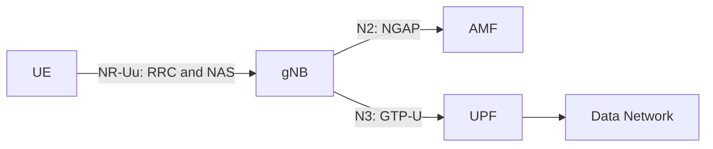
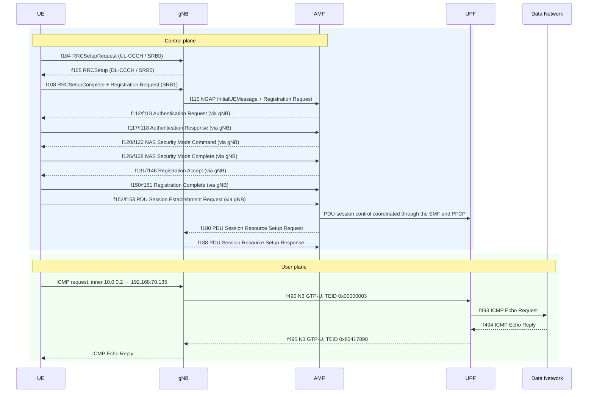

# Lab 1: Analyzing UE–gNB Connectivity in an OAI 5G SA Network(TA)

## 1. Lab Overview

### Checkpoint 1: Wireshark Setup — 10 points

Submit:

- A screenshot showing that the `OAI-5G` profile is selected. — 3 points


- A screenshot showing the opened capture. — 2 points


- A screenshot showing NR RRC packets after applying `nr-rrc`. — 5 points


---

## 5. Identify the Basic 5G SA Architecture

Complete the table:

| Component | IP address | Evidence from the capture |
|---|---|---|
| UE PDU address | 10.0.0.2 | |
| gNB | 192.168.70.129 |  |
| AMF | 192.168.70.132 |  |
| UPF | 192.168.70.134 | |
| Data Network | 192.168.70.135 | |

Complete the interface table:

| Interface | Connected components | Main protocol | Purpose |
|---|---|---|---|
| N1 | UE, AMF | NAS | UE sends registration messages to AMF via gNb |
| N2 | gNb, AMF | NGAP | gNb sends gNb-core messages to AMF |
| N3 | gNb, UPF | GTP-U | Tunnel for UE IP packets |

The logical architecture is:



## 6. Analyze the RRC Connection Establishment

Complete the table:

| Message | Direction | Logical channel / SRB | Main purpose | Packet number |
|---|---|---|---|---:|
| RRCSetupRequest | UE to gNb | UL-CCCH | UE requests connection from gNb | 104 |
| RRCSetup | gNb to UE | DL-CCCH | Supplies connection settings and establishes SRB1 | 105 |
| RRCSetupComplete | UE to gNb | UL-DCCH | Confirms setup | 108 |

Answer the following questions:

### 1. What is the establishment cause in `RRCSetupRequest`?
- UE asks gNb to establish a connection

### 2. What SRB does `RRCSetupRequest` use? Why?
- SRB0. Connection has not yet been established so UE have to communicate through the common control channel.

### 3. Which side sends `RRCSetup`?
- gNb

### 4. Which signaling radio bearer is used after the RRC connection is established?
- SRB1
   
### 5. Which NAS message is carried inside `RRCSetupComplete`?
- dedicatedNAS-Message Registration Request

### 6. At the end of this procedure, is the UE only connected to the gNB, or is it already registered with the 5G Core? Explain.
- No. Establishing RRC connection does not mean network registration is complete.

### Checkpoint 3: RRC Connection Establishment — 35 points

- Identify all three RRC messages with packet numbers and screenshots. — 12 points
- Correctly identify message directions. — 6 points
- Correctly identify UL-CCCH, DL-CCCH, SRB0, and SRB1 usage. — 7 points
- Explain the purpose of each message. — 6 points
- Explain the difference between RRC connection and 5G Registration. — 4 points

---

## 7. Connect RRC Signaling to NGAP and NAS

The UE exchanges NAS signaling with the AMF through the gNB. On the radio side, the NAS message is carried by RRC. The gNB then forwards it to the AMF through NGAP.

First, locate `RRCSetupComplete` using:

```wireshark
nr-rrc
```

Expand:

```text
RRCSetupComplete
→ dedicatedNAS-Message
→ Registration Request
```

Then apply:

```wireshark
ngap && nas-5gs
```

Locate:

```text
InitialUEMessage
→ NAS-PDU
→ Registration Request
```

Compare the two packets:

| Stage | Protocol message | Sender → receiver | Encapsulated information |
|---|---|---|---|
| Radio side | RRCSetupComplete | UE to gNb | |
| Core side | NGAP InitialUEMessage | gNb to AMF | |

Finally, locate:

- Registration Accept
- Registration Complete

Answer:

1. What is the role of the gNB when it transports NAS messages?
2. What is the difference between RRC and NAS signaling?
3. Is the Registration Request delivered directly from the UE to the AMF? Explain the protocol path.
4. Which message confirms that Registration has completed successfully?

### Checkpoint 4: RRC-to-NGAP/NAS Mapping — 25 points

- Show the Registration Request inside `RRCSetupComplete`. — 6 points
- Show the Registration Request inside NGAP `InitialUEMessage`. — 6 points
- Correctly complete the mapping table. — 5 points
- Explain the roles of RRC, NGAP, NAS, gNB, and AMF. — 5 points
- Identify Registration Accept and Registration Complete. — 3 points

---

## 8. Verify the UE IP Address and User-Plane Traffic

Apply:

```wireshark
nas-5gs || ngap
```

Find the PDU Session Establishment Accept and record the UE address:

| Field | Observed value |
|---|---|
| UE IPv4 address |  |

Apply:

```wireshark
gtp || icmp
```

Find one ICMP Echo Request and its Echo Reply. Confirm that the UE's IP packet is carried inside GTP-U between the gNB and UPF.

Answer:

1. What IPv4 address was assigned to the UE?
2. How many ICMP Echo Request/Reply pairs are present?
3. What does the successful Echo Reply prove about the UE connection?

### Checkpoint 5: UE IP and User Plane — 15 points

- Identify the UE IPv4 address in the PDU Session Establishment Accept. — 6 points
- Show one ICMP Echo Request and its Echo Reply. — 5 points
- Explain what the successful ping proves. — 4 points

---

## 9. Final UE Connection Sequence

Create one sequence diagram containing:

- UE
- gNB
- AMF
- UPF
- Data Network

Include at least:

1. RRCSetupRequest
2. RRCSetup
3. RRCSetupComplete with Registration Request
4. NGAP InitialUEMessage
5. Authentication
6. Security Mode
7. Registration Accept and Complete
8. PDU Session establishment
9. GTP-U ping

You may use:

```text
Statistics → Flow Graph → Displayed packets
```

However, the OAI RAN packets use loopback addresses. Manually separate the UE and gNB in your final diagram according to the RRC message direction.

### Checkpoint 6: Final Sequence Diagram — 5 points

- Include the required components and signaling stages. — 3 points
- Clearly distinguish control-plane and user-plane traffic. — 2 points

---

## 10. Submission and Grading

Submit one PDF or Markdown report containing:

- Completed tables
- Answers to all questions
- Packet numbers
- Required screenshots
- Final sequence diagram

Each screenshot must show:

- The display filter
- Packet number
- Info column
- Expanded protocol fields supporting your answer

| Checkpoint | Topic | Points |
|---:|---|---:|
| 1 | Wireshark profile and NR-RRC decoding | 10 |
| 2 | Basic 5G SA architecture | 10 |
| 3 | RRC connection establishment | 35 |
| 4 | RRC-to-NGAP/NAS mapping | 25 |
| 5 | UE IP and GTP-U user plane | 15 |
| 6 | Final sequence diagram | 5 |
|  | **Total** | **100** |

---

# Instructor Quick Reference

> Remove this section before distributing the student version if you do not want to reveal the expected values.

## Architecture

| Component | Expected address |
|---|---|
| UE PDU address | `10.0.0.2` |
| gNB | `192.168.70.129` |
| AMF | `192.168.70.132` |
| UPF | `192.168.70.134` |
| Data Network | `192.168.70.135` |

| Interface | Expected answer |
|---|---|
| N1 | Logical UE–AMF NAS signaling, transported through the gNB |
| N2 | gNB–AMF, SCTP/NGAP |
| N3 | gNB–UPF, UDP 2152/GTP-U |

## RRC

| Message | Direction | Channel / bearer |
|---|---|---|
| RRCSetupRequest | UE → gNB | UL-CCCH / SRB0 |
| RRCSetup | gNB → UE | DL-CCCH / SRB0 |
| RRCSetupComplete | UE → gNB | UL-DCCH / SRB1 |

- Establishment cause: `mo-Signalling`
- `RRCSetupComplete` carries the NAS Registration Request.
- The gNB forwards that NAS PDU in an NGAP `InitialUEMessage`.

## Registration

- The NAS Registration Request appears inside both `RRCSetupComplete` and NGAP `InitialUEMessage`.
- Registration Accept is sent toward the UE.
- Registration Complete is sent by the UE and confirms successful Registration.

## PDU Session and GTP-U

| Field | Expected value |
|---|---|
| UE IPv4 | `10.0.0.2` |
| Ping count | 10 Echo Request/Reply pairs |

- A successful Echo Reply confirms that the UE has an active PDU Session and working end-to-end user-plane connectivity through the gNB and 5G Core.

# Answers

> Capture analyzed: `oai-5g-combined.pcapng`. Times are relative to the first packet in that capture. All frame numbers below were verified with TShark.

## Section 5: Basic 5G SA Architecture

| Component | IP address | Evidence from the capture |
|---|---|---|
| UE PDU address | `10.0.0.2` | Inner IPv4 source in GTP-U frame 490; UE IP Address IE in PFCP frame 166 |
| gNB | `192.168.70.129` | Source of NG Setup Request frame 47; outer source of uplink GTP-U frame 490 |
| AMF | `192.168.70.132` | Source of NG Setup Response frame 49; destination of Initial UE Message frame 110 |
| UPF | `192.168.70.134` | Outer destination of uplink GTP-U frame 490; source of PFCP Session Establishment Response frame 169 |
| Data Network | `192.168.70.135` | Inner destination in frame 490; destination of decapsulated ICMP request frame 493 |

| Interface | Connected components | Main protocol | Purpose |
|---|---|---|---|
| N1 | UE ↔ AMF, logically through the gNB | NAS-5GS | Registration, authentication, security, and session-management signaling |
| N2 | gNB ↔ AMF | NGAP over SCTP | Carries NAS, UE-context control, and PDU-session resource control between the RAN and Core |
| N3 | gNB ↔ UPF | GTP-U over UDP/2152 | Carries UE user-plane IP packets through a GTP-U tunnel |

## Section 6: RRC Connection Establishment

| Message | Direction | Logical channel / SRB | Main purpose | Packet number |
|---|---|---|---|---:|
| RRCSetupRequest | UE → gNB | UL-CCCH / SRB0 | Requests an RRC connection and provides the initial UE identity and establishment cause | 104 |
| RRCSetup | gNB → UE | DL-CCCH / SRB0 | Accepts the request and supplies the radio configuration needed to create SRB1 | 105 |
| RRCSetupComplete | UE → gNB | UL-DCCH / SRB1 | Confirms RRC establishment and carries the Registration Request in `dedicatedNAS-Message` | 108 |

1. The establishment cause is **`mo-Signalling`** (TShark field value 3).
2. `RRCSetupRequest` uses **SRB0 on UL-CCCH** because dedicated SRB1 has not yet been established.
3. The **gNB sends `RRCSetup` to the UE**.
4. After establishment, the main dedicated signaling bearer is **SRB1**.
5. `RRCSetupComplete` carries a **5GMM Registration Request**.
6. The UE is only RRC-connected to the gNB at this point; it is **not yet registered with the 5G Core**. Authentication, NAS Security Mode, Registration Accept, and Registration Complete must still occur.

## Section 7: Mapping RRC to NGAP and NAS

| Stage | Protocol message | Sender → receiver | Encapsulated information |
|---|---|---|---|
| Radio side | RRCSetupComplete, frame 108 | UE → gNB | `dedicatedNAS-Message`: 5GMM Registration Request |
| Core side | NGAP InitialUEMessage, frame 110 | gNB → AMF | `NAS-PDU`: the same 5GMM Registration Request |

1. The gNB terminates radio-side RRC, extracts the NAS PDU, and forwards it to the AMF inside NGAP over N2. It performs the reverse operation for downlink NAS; it does not decide the NAS registration result.
2. **RRC** controls the UE–gNB radio connection, bearers, and radio configuration. **NAS** is logical UE–AMF signaling for registration, authentication, security, and PDU-session management. RRC transports NAS over the radio side.
3. Logically, the Registration Request is UE → AMF, but it is not delivered directly. The path is **UE → RRCSetupComplete/dedicatedNAS-Message → gNB → NGAP InitialUEMessage/NAS-PDU → AMF**.
4. The AMF sends **Registration Accept** in frame 131, and the UE returns **Registration Complete** in frame 151. Registration Complete confirms successful registration. Their inner names cannot be decoded without NAS keys because security-header type 2 indicates integrity protection and ciphering.

### Registration and security frames

| Message | Frame | Relative time | Outer NGAP procedure |
|---|---:|---:|---|
| Registration Request | 110 | 16.426161334 s | Initial UE Message |
| Authentication Request | 112 | 16.457988125 s | Downlink NAS Transport |
| Authentication Response | 118 | 16.477336863 s | Uplink NAS Transport |
| Security Mode Command | 120 | 16.479375184 s | Downlink NAS Transport |
| Security Mode Complete | 128 | 16.500759707 s | Uplink NAS Transport |
| Registration Accept | 131 | 16.504221204 s | Initial Context Setup Request |
| Registration Complete | 151 | 16.570679537 s | Uplink NAS Transport |

## Section 8: UE IP Address and User Plane

| Field | Observed value |
|---|---|
| UE IPv4 address | `10.0.0.2` |

1. The UE was assigned **`10.0.0.2`**.
2. The capture contains **10 ICMP Echo Request/Reply pairs**. The first encapsulated pair is frames **490/495**; the corresponding decapsulated packets at the UPF are frames **493/494**.
3. A successful Echo Reply proves that the UE has an active PDU Session and that the N3 GTP-U tunnel, UPF forwarding, and bidirectional UE-to-Data-Network user-plane path work correctly. It proves more than RRC establishment or registration alone.

| Direction | GTP-U frame | Inner IP | Outer IP | TEID |
|---|---:|---|---|---|
| Echo Request, uplink | 490 | `10.0.0.2` → `192.168.70.135` | `192.168.70.129` → `192.168.70.134` | `0x00000003` |
| Echo Reply, downlink | 495 | `192.168.70.135` → `10.0.0.2` | `192.168.70.134` → `192.168.70.129` | `0x80417898` |

All 10 requests received replies, so the success rate is **100%**. The average RTT measured between the captured GTP-U request and reply is **0.393217 ms**.

## Section 9: Final UE Connection Sequence



## Display Filters Used

```wireshark
nr-rrc
ngap
ngap && nas-5gs
nas-5gs || ngap
gtp || icmp
pfcp
```

> Checkpoint 1 requires three Wireshark GUI screenshots: the selected `OAI-5G` profile, the opened capture, and the result of applying `nr-rrc`. These screenshots cannot be replaced by Markdown text and still need to be added manually before submission. All written questions and blank tables are answered above.
